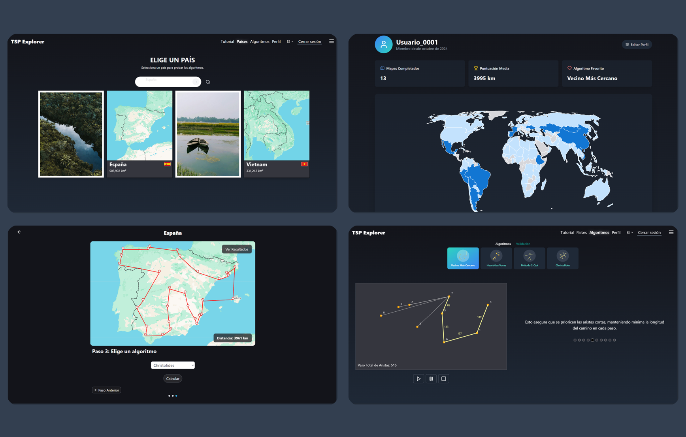
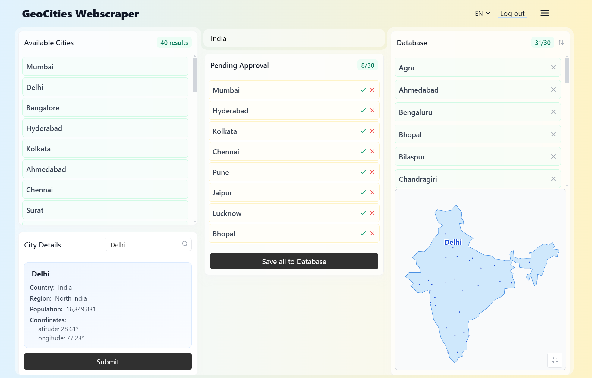
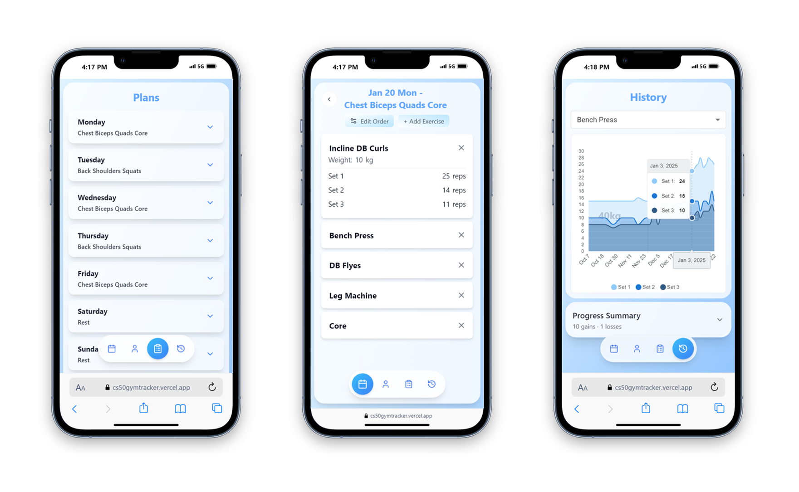
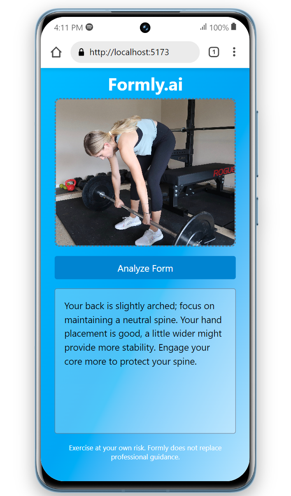
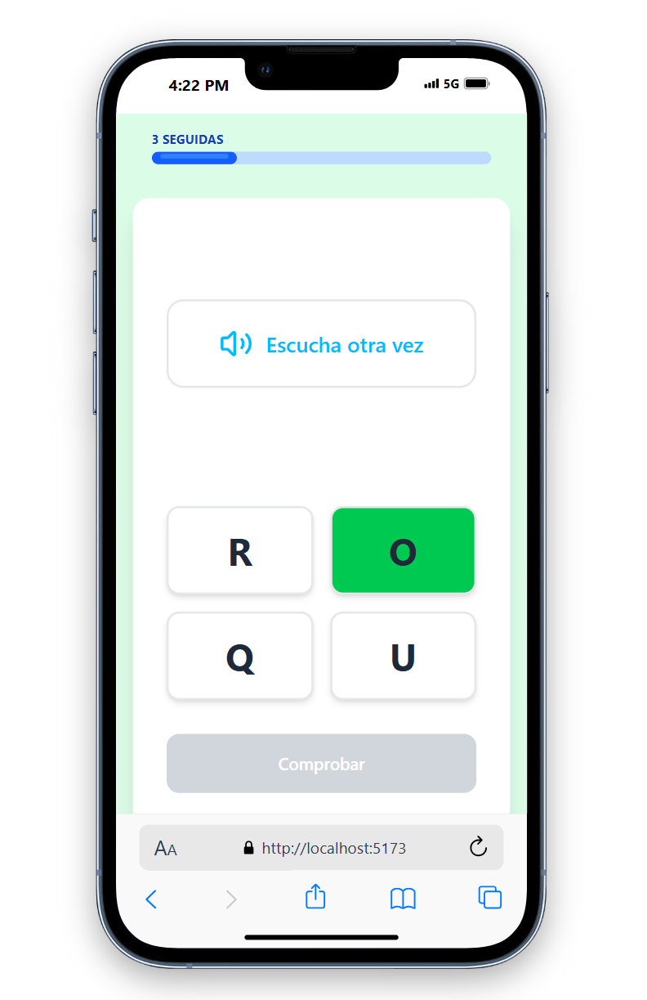

  

   
I am <a href="https://www.linkedin.com/in/jannik-riegel/">Jannik Riegel</a>, a Frontend Developer specialized in React and its ecosystem, with solid experience in creating responsive and efficient web applications using TypeScript, Redux, Next.js, and Tailwind CSS. My experience also includes working with SQL databases, allowing me to understand and contribute to full-stack projects when needed. I handle key tools like Git, agile methodologies like Scrum, and development practices such as TDD and Clean Code. Recently, I've been focused on integrating AI APIs and cloud technologies like AWS and Docker into my projects to adapt to the innovations that are transforming the tech industry. I'm looking to join a dynamic team where I can contribute my frontend development experience and continue growing professionally through meaningful projects.

  

## About Me:

- 💼 I'm currently working as FrontEnd developer and ux/ui designer at [CCAR - Comissió Catalana d'Ajuda al Refugiat](https://www.ccar.cat/) (part time).

- 🌐 I'm currently studying AI Programming through [Harvard CS50's Introduction to Artificial Intelligence with Python](https://pll.harvard.edu/course/cs50s-introduction-artificial-intelligence-python).

- 🎓 I’ve just completed a 9-month, state-subsidized Front End Developer bootcamp at [IT Academy - Barcelona Activa](https://www.barcelonactiva.cat/es/itacademy).

## 🧰 Languages and Tools

  

## 🆕 My Latest Projects

## TSP Explorer

> Educational Website for Exploring and Understanding the Traveling Salesman Problem (TSP)

This application implements and showcases various algorithms to solve the TSP, from simple heuristics to local optimization techniques. The user interface allows users to create, modify and visualize routes in real-time. 

  

## GeoCities Webscraper

> Automated Web Scraper that Collects and Analyzes City Data from Web Sources

Implements advanced web scraping and data processing techniques to gather geographical information about cities worldwide. Allows users to save cities to a database, view them on an interactive map, and make modifications directly through the interface.
 

  

## CS50 Gym Tracker:

> Mobile App for Tracking Gym Workout Routines and Progress

Allows users to create and follow custom routines, record their progress, and visualize detailed statistics about their performance over time.
 

  

## AI Form Assistant

> Exercise Technique Assistant Based on AI Feature

An AI assistant that helps users analyze and correct their exercise technique at the gym.
 

   

## LetraLingo App

> Alphabetization App for the Spanish Alphabet

An interactive Spanish alphabet learning app with integrated AI teaching methods. Users progress through engaging lessons that teach letter recognition, pronunciation, and basic writing skills in Spanish. Features include interactive exercises, pronunciation guides and progress tracking to make learning the Spanish alphabet fun and effective.
 

    

---

# 🚧 CURRENTLY WORKING ON ... 🚧

 

### LetraLingo - React Alphabetization App

**LetraLingo** is an intelligent alphabetization tool designed to teach reading and writing using the latin alphabet. This app allows users to to advance at their own pace and using a progress algorithm and a variety of exercise categories.

### Features

- Progress-Based Tasks: Utilizes an algorithm analyzing previous test outcomes to recommend further exercises that match the user's learning speed.
- Progress Overview: Allows users to track their progress across different letters and exercise categories.
- Responsive UI: Built with a focus on usability and responsiveness, ensuring a seamless experience across devices.

### Technical details and goals

- Tech and tools: Developed using React + TypeScript, TailwindCSS, CSS, SQL, Node.js, Railway.
- Context: Implements the Context to manage application state globally, facilitating task selection and submissions via the server while minimizing prop drilling.
- SOLID Principles: Adheres to SOLID design principles, ensuring code is maintainable and scalable:
  - Components are designed to handle one specific task, promoting clarity and reusability.
  - The app is open for extension (e.g., adding new exercises or letters) but closed for modification, preserving existing functionality.
  - Ensures components can be replaced without altering the app's behavior.
  - Utilizes smaller, specific interfaces for components, allowing for more flexibility.
  - High-level components depend on abstractions rather than concrete implementations.

The ongoing development of LetraLingo aims to enhance feature sets, improve the overall user experience, and maintain high code quality through best practices.

### Check out the development of LetraLingo 🍿

---

   

## 📊 Stats

 

<table align="center">
  <tr>
    <td align="center">
      
    </td>
  </tr>
  <tr>
    <td align="center">
      
      
    </td>
  </tr>
  
</table>

   

## 📧 Feel free to contact me

   

  

<h3 align="center">📌 Explore My Pinned Projects Below!</h3>
